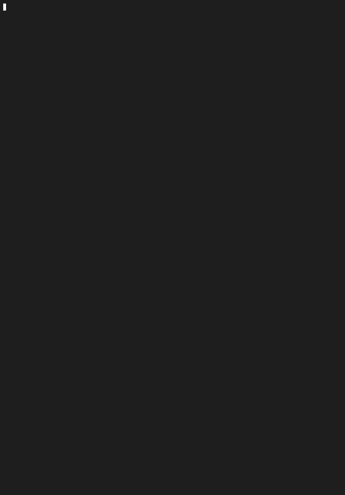

# Network Packet Sniffer & Protocol Analyzer

A command-line network analyzer written from scratch in C — a stripped-down
Wireshark. It captures live traffic with `libpcap`, decodes each packet layer by
layer (Ethernet → IP → TCP/UDP/ICMP) by parsing raw bytes into structs, filters
it, and reports live statistics.

I built this to go deep on the fundamentals that systems and networking roles
care about: raw packet capture, manual header parsing at the byte level, network
byte order, bit manipulation, the OSI model, and memory-safe C.

## Demo

Live capture of HTTPS traffic, decoded layer by layer with a hex payload preview,
ending in the on-exit statistics summary:



```
[ETH] ac:de:48:00:11:22 -> 3c:22:fb:aa:bb:cc | Type: IPv4 (0x0800)
[IP]  192.168.1.185 -> 142.250.80.46 | Proto: TCP | TTL: 64 | Len: 60
[TCP] Port 54312 -> 443 | Flags: SYN ACK | Seq: 3842910123 | Win: 65535
```

---

## Features

- **Layer-by-layer decoding** of Ethernet, IPv4, TCP, UDP, and ICMP headers.
- **Userspace filtering** by protocol, port, or host (`--proto`, `--port`, `--host`).
- **In-kernel BPF filtering** via a raw libpcap expression (`--bpf "tcp and port 80"`).
- **Hex + ASCII payload preview** (`--hex`) in a hex-editor style layout.
- **`.pcap` capture file output** (`--write`) that opens in Wireshark/tcpdump.
- **Live statistics** on exit: per-protocol breakdown, total bytes, and top
  source IPs by traffic volume.
- **Memory-safe**: bounds-checked at every layer; **zero leaks** (verified with
  `leaks`); warning-free `-Wall -Wextra` build; allocation-free, stack-based
  parsing path.

---

## Build

Requires a C11 compiler and `libpcap` (preinstalled on macOS via the Xcode SDK;
`sudo apt install libpcap-dev` on Debian/Ubuntu).

```bash
make            # optimized build -> ./sniffer
make debug      # build with -g + AddressSanitizer
make clean
```

---

## Usage

Live capture requires root (raw packet capture reads from a kernel BPF device):

```bash
sudo ./sniffer -i en0                              # capture on en0 (auto if omitted)
sudo ./sniffer -i en0 --proto tcp --port 443       # only HTTPS
sudo ./sniffer -i en0 --host 8.8.8.8               # only traffic to/from 8.8.8.8
sudo ./sniffer -i en0 --bpf "udp and port 53"      # in-kernel BPF filter (DNS)
sudo ./sniffer -i en0 --proto tcp --hex            # show payload hex dump
sudo ./sniffer -i en0 -w capture.pcap              # save to a Wireshark file
```

> On Linux, interfaces are named `eth0`/`wlan0`; on macOS they're `en0`, `en1`, …
> Run `ifconfig` (macOS) or `ip link` (Linux) to list them.

Run `./sniffer -h` for the full flag list.

---

## Architecture

The capture engine hands each raw frame to a parsing pipeline. Each layer
identifies the next (EtherType → IP protocol number), and parsing only proceeds
when a bounds check confirms the bytes are present.

```
                 +------------------+
   libpcap  -->  |   capture.c      |  open device, pcap_loop, SIGINT handling
                 +--------+---------+
                          | raw bytes
                          v
                 +------------------+
                 |   ethernet.c     |  L2: MACs + EtherType  --> if IPv4...
                 +--------+---------+
                          v
                 +------------------+
                 |      ip.c        |  L3: addresses, protocol, TTL, IHL
                 +--------+---------+
                          | dispatch on protocol number
            +-------------+-------------+
            v             v             v
       +---------+   +---------+   +----------+
       |  TCP    |   |  UDP    |   |  ICMP    |   transport.c (L4)
       +----+----+   +----+----+   +-----+----+
            |             |              |
            +-------------+--------------+
                          v
            filter.c  (match?) --> stats.c (record) --> display.c (print)
```

| File | Responsibility |
|------|----------------|
| `main.c` | Entry point; locale setup |
| `capture.c` | libpcap setup, capture loop, SIGINT handling, BPF/dump wiring |
| `ethernet.c` | Layer 2 parsing |
| `ip.c` | Layer 3 (IPv4) parsing |
| `transport.c` | Layer 4 (TCP/UDP/ICMP) parsing |
| `filter.c` | CLI argument parsing (`getopt_long`) + the userspace filter engine |
| `stats.c` | Counters, top-talker tracking, summary report |
| `display.c` | All human-readable formatting |

A deeper, stage-by-stage explanation of the concepts (network byte order,
struct-overlay parsing, alignment, bit masking, signal safety, and more) lives
in [`concept_walkthrough.md`](concept_walkthrough.md).

---

## What I learned

- **Network byte order is everywhere.** Multi-byte numeric fields travel
  big-endian, so every 16/32-bit field goes through `ntohs`/`ntohl` — but byte
  arrays like MAC addresses do not. Mixing these up produces silent garbage.
- **Struct-overlay parsing has a sharp edge: alignment.** Casting raw bytes onto
  a struct works for the Ethernet header (no padding, offset 0) but is undefined
  behavior for the IP header, which lands at an unaligned offset and contains
  32-bit fields — so I `memcpy` those instead. Knowing *why* was the real lesson.
- **Signal handlers must stay tiny.** Printing the summary directly from the
  Ctrl+C handler would call non-async-signal-safe functions; instead the handler
  only breaks the capture loop, and the report prints in normal control flow.
- **Defensive parsing.** Real packets can be malformed or truncated, so every
  layer bounds-checks the captured length before dereferencing.

---

## Notes on portability

Developed and tested on macOS (Apple Silicon, libpcap 1.10.1). The code uses the
modern `pcap_findalldevs()` rather than the deprecated `pcap_lookupdev()`, and
the same `Makefile` (driven by `pcap-config`) builds on Linux. The sniffer
verifies the link type is Ethernet (`DLT_EN10MB`) before parsing.
